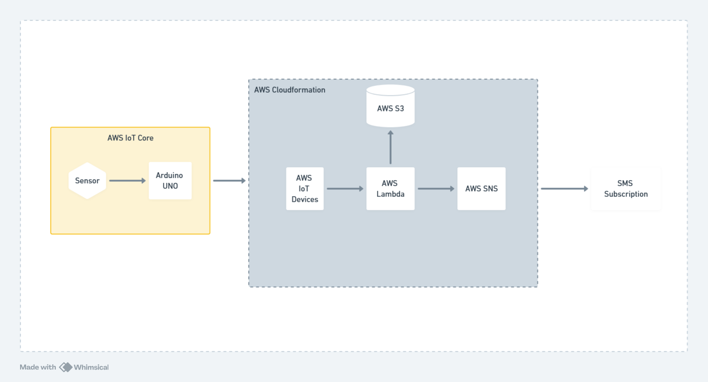

# Sensor data collection

Repositório contendo meu projeto pessoal envolvendo arduino e AWS para monitoramento de solo.
Este projeto visa aprimorar meus conhecimentos de AWS ponta-a-ponta, provisionando toda a infraestutura como código, 
além de um aprendizado que eu sempre tive curiosidade que é o de utilização de sensores e IoT no geral.

Eventualmente penso em agregar algum tipo de analytics a este fluxo, mesmo que de forma simplificada, pra também 
dominar ferramentas nesse segmento.
